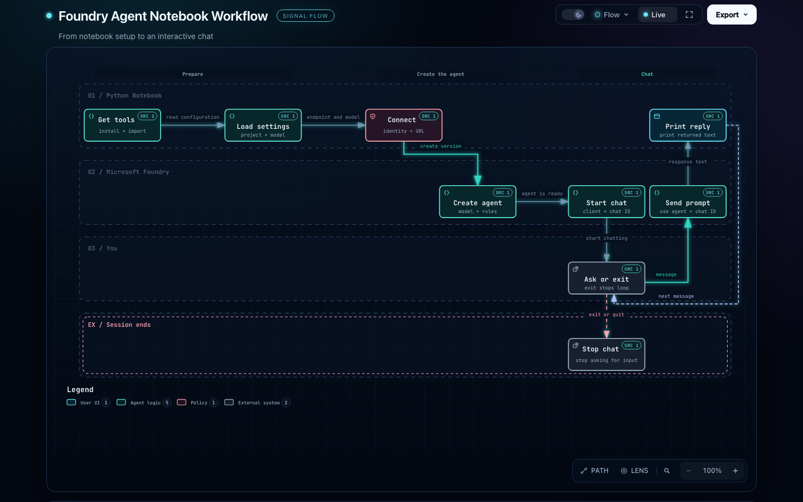

# Foundry Agent Notebook: Beginner Workflow Notes

This notebook builds a small Foundry agent and lets you chat with it. The big picture is:

> Prepare tools -> load settings -> connect to Foundry -> create the agent -> open a conversation -> chat until you exit

**Interactive diagram:** [Open the Flow view in dark mode](https://sanskar220901.github.io/MicrosoftFoundry/?theme=dark). The HTML is also committed as [foundry-agent-chat-workflow-interactive.html](foundry-agent-chat-workflow-interactive.html).

Hover over a node or connection to preview its path. Use the diagram's Live/Still control to play or pause the animated trace. GitHub's source and Markdown views do not run interactive HTML; the Pages link works after the one-time setup below.

## Visual overview

The diagram follows the notebook's real path: setup happens once, the agent version is created, and then each message travels through the same conversation. The reply returns to the prompt so the loop can continue. Typing `exit` or `quit` takes the stop branch.

## A simple analogy

Think of it like setting up a small restaurant:

- The installed libraries are the kitchen tools.
- The `.env` file is a note with the project address and chosen model.
- Azure sign-in is your staff ID.
- The project client is the front desk that connects you to the right kitchen.
- The agent version is a reusable recipe: it names the model and gives it instructions.
- The conversation is one ongoing order ticket that keeps the chat together.
- Each message is a new order; the printed response is what comes back to you.
- `exit` or `quit` closes the ticket and stops the loop.

The analogy is only a memory aid. In the notebook, Azure and the model service perform the actual work.

## Open the interactive page on GitHub

GitHub Pages is not enabled for this repository yet. To publish the interactive diagram, open **Settings -> Pages**, set the build source to **GitHub Actions**, then run the `Publish workflow diagram` workflow from the **Actions** tab if the initial push ran before Pages was enabled. The workflow publishes only the standalone diagram as the Pages home page.

## Cell-by-cell guide

Markdown heading cells organize the notebook; they do not run Python. These are the cells that perform the work:

### Cell 3: Install the libraries

`%pip install` installs the packages the notebook needs: the Foundry project SDK, the OpenAI-compatible client, environment-file support, and Azure identity support. The exact versions are pinned in the command so this example uses known package versions.

**Why:** Python cannot use a library until it is installed in the notebook environment.

### Cell 5: Import tools and load settings

The `import` lines make functions and classes available. `load_dotenv()` reads values from the `.env` file, and `os.getenv(...)` puts the project endpoint and model deployment name into Python variables.

**Why:** Keep configuration outside the code so the same notebook can point at the right project and model without hardcoding those values.

### Cell 7: Connect to the Foundry project

`AIProjectClient(...)` receives the project endpoint and `DefaultAzureCredential()`. The endpoint says where the project is; the credential lets Azure identify the signed-in user.

**Why:** This creates the connection object used by later cells. It does not create the agent by itself.

### Cell 9: Create an agent version

`PromptAgentDefinition` describes the agent using the selected model and instruction text. `project_client.agents.create_version(...)` sends that definition to Foundry and returns the created version.

**Why:** This makes the reusable agent configuration available to the later chat requests.

### Cell 11: Prepare the chat conversation

`get_openai_client()` provides the OpenAI-compatible interface. `conversations.create()` creates a conversation and returns its ID.

**Why:** The conversation ID lets later requests belong to the same ongoing chat, rather than treating every message as unrelated.

### Cell 13: Chat in a loop

`while chat:` repeats the same block. `input(...)` waits for a message. The `if` statement checks whether the message is `exit` or `quit`; if so, it stops. Otherwise, `responses.create(...)` sends the message with the agent reference and conversation ID. Finally, `print(...)` displays the returned text.

**Why:** The loop lets you ask multiple questions in the same conversation. You do not have to recreate the agent or conversation for every message.

Cell 14 is empty and can be ignored.

## Two important names

- **Agent version:** the reusable configuration for how the assistant should behave and which model it uses.
- **Conversation:** the ongoing chat session that groups messages together.

Memory hook: **the agent is the recipe; the conversation is the current order ticket.**

## The Python ideas in this notebook

- `=` stores a value in a variable.
- `import` makes installed tools available.
- A function call such as `input(...)` asks for or performs work.
- `if` chooses between paths.
- `while` repeats a block until its condition becomes false.
- `print(...)` displays text.

You do not need to memorize the SDK calls. Remember the order and purpose: **prepare, connect, create, chat, display**.

## Keep settings private

The `.env` file contains local configuration. Do not paste its values into public notes or commit secrets. The diagram links to the notebook source for code context but does not include the endpoint value.
