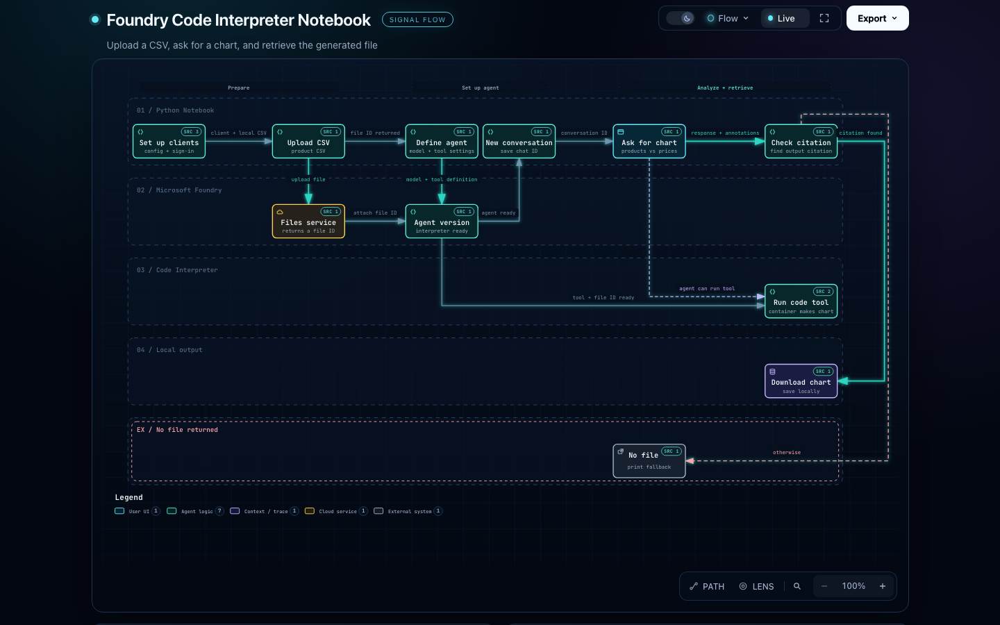

# Foundry Code Interpreter: Beginner Workflow Notes

This notebook shows how to give a Foundry agent a CSV file, ask it to make a chart, and download a generated file when the response includes a file citation.

> Prepare access -> upload the input CSV -> configure the agent's tool -> ask for a chart -> check for a file citation -> download the output when available

**Interactive diagram:** [Open the workflow in dark Flow mode](https://sanskar220901.github.io/MicrosoftFoundry/code-interpreter/?theme=dark). The diagram source and interactive HTML are also committed at [the workflow artifact](../.archify/workflow-code-interpreter-20261005-114243/code-interpreter-analysis.html).

GitHub's Markdown/source page displays the preview image; it does not run interactive HTML. GitHub Pages is not enabled for this repository yet. To activate the interactive link, open **Repository Settings -> Pages**, set the build source to **GitHub Actions**, then rerun **Publish workflow diagram** from the **Actions** tab. The workflow publishes this diagram at the `/code-interpreter/` route.

## The idea in plain English

The notebook sends the input CSV to Foundry, configures an agent with the Code Interpreter tool and that uploaded file, then asks for a column chart of product prices. It checks the response annotations for a reference to a generated file. When that reference exists, it downloads the file from the tool container and writes it to the notebook's local working folder. If no file citation is present, it prints a fallback message instead.

The notebook cells have not been run in this workspace. These notes explain the code's intended flow, not a verified successful chart generation.

## An analogy to remember it

Think of the notebook as a person sending ingredients to a restaurant kitchen:

- The CSV upload is handing over the ingredients.
- The uploaded file ID is the kitchen's ticket number for those ingredients.
- The agent definition is the recipe card that says which model to use and which tool it may use.
- The Code Interpreter container is a temporary workbench where the data can be analyzed and a chart file can be made.
- The conversation ID is the order ticket that keeps the request associated with the conversation.
- A container file citation is a pickup slip for a generated result.
- The download step brings the result from the workbench back to your computer.

The two IDs are not interchangeable: the uploaded CSV's file ID is used as tool input; the container file citation identifies an output file to retrieve later.

## Cell-by-cell guide

Markdown cells are section headings or the existing lab-flow picture. They organize the notebook but do not run Python. The code cells do the following:

### Cell 4: Install libraries

`%pip install` installs the Foundry project SDK, the OpenAI-compatible client, environment-file support, and Azure identity support. The versions are pinned in the command.

**Why:** Python needs these packages to connect to Foundry, authenticate, upload files, and send requests.

### Cell 6: Import tools and load settings

The imports make the required Python tools available. `load_dotenv()` reads local settings, and `os.getenv(...)` reads the project endpoint and model deployment name.

**Why:** The code can use the configured project and model without placing those values directly in the notebook.

### Cell 8: Create the Foundry project client

`AIProjectClient(...)` combines the project endpoint with `DefaultAzureCredential()`.

**Why:** The endpoint says where the Foundry project is; the credential lets Azure identify the signed-in user.

### Cell 10: Create the OpenAI-compatible client

`project_client.get_openai_client()` provides the client used by the later file, conversation, and response calls.

**Why:** This is the notebook's route for using the OpenAI-style API through the Foundry project.

### Cell 12: Upload the CSV

`openai_client.files.create(...)` reads `electronics_products.csv` and uploads it with the `assistants` purpose. The returned `file.id` is printed.

**Why:** The agent's tool needs access to the input data. The local path is where Python reads the file; the returned ID is how later code refers to the uploaded copy.

### Cell 14: Create the agent version with Code Interpreter

`PromptAgentDefinition` sets the model and instructions. Its `tools` list includes `CodeInterpreterTool`, with `CodeInterpreterToolAuto` configured using the uploaded CSV's file ID. `create_version(...)` sends this definition to Foundry.

**Why:** This configures what model the agent uses and gives its Code Interpreter tool access to the uploaded input file.

### Cell 16: Create a conversation

`openai_client.conversations.create()` creates a conversation and saves the returned conversation ID.

**Why:** The request can be associated with this conversation rather than standing alone.

### Cell 18: Ask for the chart

`responses.create(...)` sends the chart request, conversation ID, and agent reference. The prompt asks for a column chart with products on the x-axis and prices on the y-axis.

**Why:** This is where the notebook asks the configured agent to do the analysis. The notebook code configures the tool and requests the chart; this workspace has not run the cells to verify the model's actual response.

### Cell 20: Look for and download an output file

The code inspects the last response message, its text annotations, and the last annotation. It proceeds only when that annotation is a `container_file_citation`. It then reads the citation's file and container IDs, retrieves the file contents, and writes those bytes to a local file using the returned filename. If no usable citation was found, it prints `No file generated in response`.

**Why:** A generated file in the tool container is not yet a local file. This cell checks for the pickup information and performs the download only when it is present.

## The basic Python ideas

- A variable such as `file_id` stores a value so later code can reuse it.
- A function call such as `files.create(...)` asks a library to perform an action.
- `if` checks conditions and chooses a path.
- `with open(..., "wb")` opens a local file for writing bytes, and closes it safely afterward.
- `.read()` gets the retrieved file bytes; `.write(...)` saves those bytes locally.

## Short memory version

> Upload the input, give its ID to the tool, ask the agent, check the citation, then download the output.
