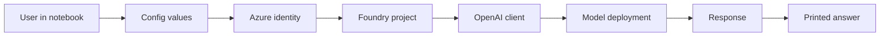

# Microsoft Foundry + OpenAI: Archify Mental Model

This notebook is a small system pattern:

> It loads configuration, signs in securely, connects to a Foundry project, sends a prompt to a deployed model, and prints the result.

If you remember only one sentence, remember this:

> Config -> Auth -> Project -> Prompt -> Output

---

## Architecture view

This is the system as a simple architecture diagram.



This is the Archify-style pattern we will use going forward:

- short labels
- left-to-right flow
- one clear idea per box
- no syntax-heavy text clutter
- focus on why the system exists, not just what the code writes

---

## What each part is doing

### 1) Local config
The `.env` file contains values like:

```text
FOUNDRY_PROJECT_ENDPOINT=https://your-project-url
MODEL_DEPLOYMENT_NAME=my-model
```

This is the notebook's setup file. It keeps important values outside the code so we do not hardcode secrets or connection details.

Memory hook:

> The config file is the address book.

---

### 2) Azure identity
This line is the login step:

```python
from azure.identity import DefaultAzureCredential
```

It tells Python: "Use my Azure login credentials to prove I am allowed to access this project."

This is important because the system must know who you are before it can talk to Azure resources.

Memory hook:

> Identity is the ID card.

---

### 3) Foundry project connection
This is the project access point:

```python
project_client = AIProjectClient(
    endpoint=foundry_project_endpoint,
    credential=DefaultAzureCredential()
)
```

This creates a connection to your Azure AI Foundry project.

The important idea is simple:

- endpoint = where the project lives
- credential = who is allowed to access it

Memory hook:

> The project client is the front desk that knows the office address.

---

### 4) OpenAI-compatible client
This step converts the Azure project client into a model-calling client:

```python
openai_client = project_client.get_openai_client()
```

Now the code can use the same style of calls you would use with OpenAI, but the request is actually routed through your Foundry project.

This is a compatibility layer.

Memory hook:

> It is like switching from a general front desk to a specialist desk for model requests.

---

### 5) Model deployment
This is the actual LLM call:

```python
response = openai_client.responses.create(
    model=model_deployment_name,
    instructions="You are a helpful AI assistant.",
    input="Can you tell me about Microsoft Foundry?"
)
```

Here is the real action:

- `model` tells Azure which deployed model to use
- `instructions` guides the tone and behavior
- `input` is the actual question

This is the notebook's main task.

Memory hook:

> The model is the chef. The prompt is the order.

---

### 6) Output
This line shows the answer:

```python
print(f"Response output: {response.output_text}")
```

The model returns text, and Python prints it. This is the final stage of the flow.

Memory hook:

> The kitchen sends the meal, and the notebook serves it to the screen.

---

## Cell-by-cell explanation

### Cell 1: Install required libraries

```python
%pip install azure-ai-projects==2.0.0b2 openai==1.109.1 python-dotenv azure-identity
```

What this does:

- installs the tools needed to connect to Azure AI Foundry
- gives Python the packages for environment variables and Azure auth
- prepares the notebook to call the model

Why it matters:

Without these packages, the notebook cannot talk to Azure or use the OpenAI-style client.

---

### Cell 2: Import the libraries

```python
import os
from dotenv import load_dotenv
from azure.identity import DefaultAzureCredential
from azure.ai.projects import AIProjectClient
```

What this does:

- imports environment access
- imports environment loader
- imports Azure identity support
- imports the Foundry project client

Why it matters:

This is the setup phase. The code is preparing the building blocks that the notebook will use later.

---

### Cell 3: Read config values

```python
load_dotenv()
foundry_project_endpoint = os.getenv("FOUNDRY_PROJECT_ENDPOINT")
model_deployment_name = os.getenv("MODEL_DEPLOYMENT_NAME")
```

What this does:

- loads values from a local `.env` file
- reads the endpoint for the Foundry project
- reads the model deployment name to use

Why it matters:

It avoids hardcoded secrets and makes the project easier to reuse in different environments.

---

### Cell 4: Create project client

```python
project_client = AIProjectClient(
    endpoint=foundry_project_endpoint,
    credential=DefaultAzureCredential()
)
```

What this does:

- tells the code where the Azure AI Foundry project is
- tells Azure who is trying to connect

Why it matters:

This is the actual connection step.

---

### Cell 5: Create OpenAI-style client

```python
openai_client = project_client.get_openai_client()
```

What this does:

- exposes the Foundry project through an OpenAI-compatible interface

Why it matters:

This lets the code use familiar model call patterns without needing a completely different API style.

---

### Cell 6: Send the request

```python
response = openai_client.responses.create(
    model=model_deployment_name,
    instructions="You are a helpful AI assistant.",
    input="Can you tell me about Microsoft Foundry?"
)
```

What this does:

- selects the right deployed model
- tells the model how to behave
- sends the actual user question

Why it matters:

This is the moment the notebook asks the AI for an answer.

---

### Cell 7: Show the answer

```python
print(f"Response output: {response.output_text}")
```

What this does:

- prints the text returned by the model

Why it matters:

Without this step, the user would not see the answer in the notebook output.

---

## Why this pattern matters

This is the basic AI app pattern:

1. configuration
2. identity
3. project access
4. model call
5. output display

You will reuse this pattern again and again in:

- chat apps
- Q&A systems
- document processing
- AI assistants
- agent workflows

---

## Beginner memory model

Think of the notebook as a delivery flow:

- `.env` file = address and order details
- Azure login = proof of identity
- Foundry project = the destination
- OpenAI client = the ordering system
- model = the worker that answers
- output = the final result on screen

One simple memory sentence:

> Config, login, connect, ask, answer.

---

## Archify documentation rule for future docs

From now on, future documentation in this repo should follow these rules:

- use short labels
- show the system as a flow, not as raw code
- explain the purpose of each block in plain English
- keep the diagram readable at a glance
- use simple analogies for beginners
- prefer architecture meaning over syntax detail

That is the standard we will apply to future notebooks and project docs.

---

## The one thing to remember

The real lesson is not the exact syntax. The real lesson is the flow:

```text
config values -> Azure login -> Foundry project -> model call -> response -> printed answer
```

That is the mental model behind this notebook.
