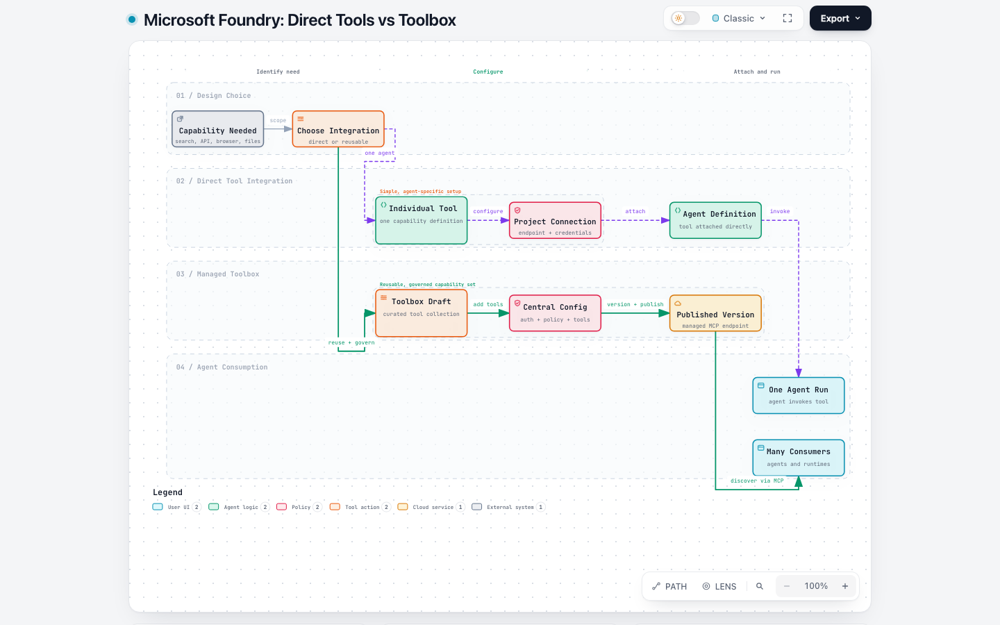

# Microsoft Foundry Tools vs Toolbox

In the current Microsoft Foundry experience, a **tool** is one capability an agent can call. A **toolbox** is a managed, reusable, and versioned collection of tools that agents and other runtimes consume through one MCP-compatible endpoint.

> **A tool does the work. A toolbox packages, governs, and shares tools.**

**Interactive diagram:** [Open the workflow](https://sanskar220901.github.io/MicrosoftFoundry/tools-vs-toolbox/). The [Archify source and standalone HTML](../.archify/workflow-foundry-tools-vs-toolbox-20261006-160503/foundry-tools-vs-toolbox.html) are committed with this guide.

## The four objects to keep separate

| Object | What it represents | Example |
| --- | --- | --- |
| **Tool** | One callable capability available to an agent | Web Search, OpenAPI, File Search, Browser Automation |
| **Connection** | Stored endpoint and authentication configuration used by a tool | API key, managed identity settings, Playwright workspace connection |
| **Toolbox** | A managed, versioned set of tools exposed through a shared MCP-compatible endpoint | A support toolbox containing search, ticketing, and browser tools |
| **Agent** | The model-driven runtime that chooses and invokes available tools | A support agent that searches documentation and creates a ticket |

A connection is not itself a tool. It supplies access information to a tool. Likewise, a toolbox does not replace the tools inside it; it provides a reusable management and delivery layer around them.

## Direct tool integration

With direct integration, a tool is attached to a particular agent definition.

1. Select or define the tool.
2. Create any required project connection.
3. Attach the tool to the agent.
4. Create a new agent version and invoke it.

This path is useful when:

- only one agent needs the capability;
- the configuration is small and unlikely to be shared;
- you want the shortest development path;
- the capability supports direct integration.

The tradeoff is that configuration, credentials, and policy can become duplicated as more agents need the same tools.

## Toolbox integration

A toolbox packages tools as a centrally managed resource.

1. Go to **Build → Tools** in the Foundry portal.
2. Select **Create a toolbox**.
3. Add and configure one or more tools.
4. Publish a toolbox version.
5. Connect agents or MCP-compatible runtimes to the published toolbox.

A toolbox provides:

- one managed MCP-compatible endpoint;
- centralized authentication and connection management;
- tool and policy governance;
- reusable configuration across multiple agents and frameworks;
- versioning, testing, and promotion of changes;
- tool discovery without wiring each capability separately into every consumer.

Use this path when multiple agents need the same capabilities, credentials must be managed centrally, or tool changes should be promoted independently from agent code.

## Quick comparison

| Question | Direct tool | Toolbox |
| --- | --- | --- |
| Scope | Usually one agent definition | Multiple agents or runtimes |
| Configuration | Attached directly to the agent | Curated in a managed toolbox |
| Endpoint | Depends on the individual tool | One MCP-compatible toolbox endpoint |
| Credentials | Managed per tool/connection | Centralized behind the toolbox |
| Versioning | Usually follows the agent version | Toolbox has its own versions |
| Reuse | Manual repetition across agents | Designed for reuse |
| Governance | Agent-by-agent | Centralized policies and lifecycle |
| Best fit | Prototypes and isolated integrations | Shared and production-oriented capabilities |

## Tool support is not identical

Many Foundry capabilities support both direct integration and toolboxes, including MCP, Web Search, Azure AI Search, Code Interpreter, File Search, OpenAPI, agent-to-agent, and Browser Automation.

Some capabilities are toolbox-only, while others remain direct-only. For example, current Foundry documentation lists Tool Search, Skills, and Reminder as toolbox-only, while function calling, Computer Use, image generation, SharePoint, and Azure Functions are direct integrations rather than toolbox tools. Always check the current support table before choosing an architecture.

Tool availability can also depend on the Foundry project region and deployed model.

## Example: Browser Automation

The current Browser Automation setup illustrates the difference:

- **Tool:** Browser Automation provides the callable browser capability.
- **Connection:** The project connection stores the Playwright workspace endpoint and authentication configuration.
- **Toolbox:** The Browser Automation tool can be added to a toolbox, published, and reused.
- **Agent:** The agent consumes the direct tool or the published toolbox and decides when to invoke browser operations.

Seeing a Playwright workspace in Azure does not automatically configure Browser Automation in Foundry. You must still create the Foundry project connection and attach the tool directly or publish it through a toolbox.

## Decision rule

Start with a direct tool when you are experimenting with one agent. Move to a toolbox when the capability becomes shared infrastructure or requires centralized credentials, policy, versioning, and governance.

## References

- [What is Toolbox in Microsoft Foundry?](https://learn.microsoft.com/en-us/azure/foundry/agents/concepts/toolbox-overview)
- [Create and manage a toolbox](https://learn.microsoft.com/en-us/azure/foundry/agents/how-to/tools/toolbox)
- [Foundry tool best practices](https://learn.microsoft.com/en-us/azure/foundry/agents/concepts/tool-best-practice)
- [Browser Automation tool](https://learn.microsoft.com/en-us/azure/foundry/agents/how-to/tools/browser-automation)
- [Tool support by region and model](https://learn.microsoft.com/en-us/azure/foundry/agents/concepts/limits-quotas-regions)
