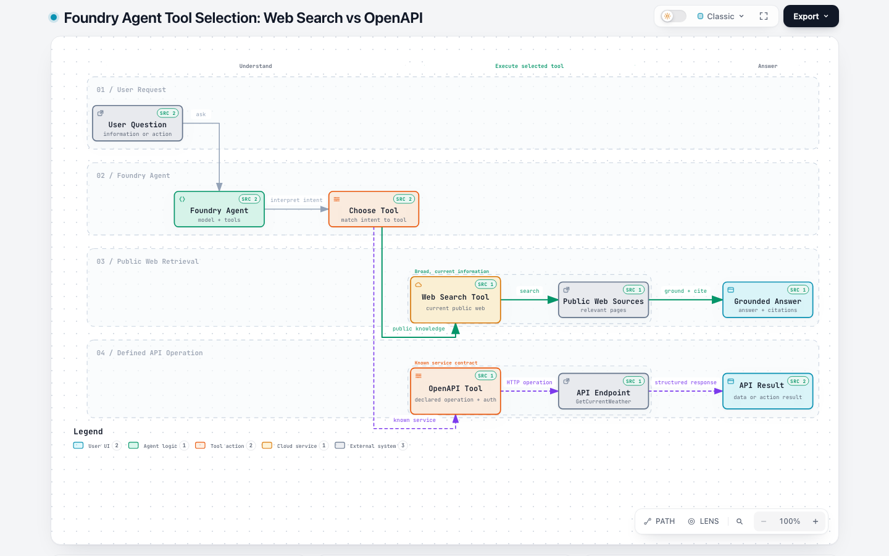

# Foundry Web Search vs OpenAPI Tool

Both tools let a Microsoft Foundry agent reach information outside the model, but they solve different problems.

> **Web Search searches public knowledge. OpenAPI calls a specific service.**

**Interactive diagram:** [Open the workflow](https://sanskar220901.github.io/MicrosoftFoundry/tool-selection/). Its [Archify source and standalone HTML](../.archify/workflow-foundry-web-search-vs-openapi-20261006-143303/foundry-web-search-vs-openapi.html) are committed with this guide.

## Quick comparison

| Question | Web Search tool | OpenAPI tool |
| --- | --- | --- |
| What does it do? | Searches current public-web information | Calls operations exposed by a particular API |
| Where does data come from? | Public pages found through Bing-backed grounding | Endpoints declared in an OpenAPI 3.0 or 3.1 specification |
| What must you configure? | Add the supported web-search tool to the agent | Supply an OpenAPI specification and the required authentication |
| What does the agent receive? | Search-grounded information suitable for synthesis and citations | The API operation's response or action outcome |
| Can it take an action? | It is primarily an information-retrieval tool | Yes, if the specification exposes an allowed write operation |
| Best fit | News, recent facts, and broad research | Business systems, internal services, transactions, and structured lookups |

## How the flows differ

### Web Search

1. The user asks for current or broad public information.
2. The agent selects the Web Search tool.
3. The tool searches relevant public sources.
4. The model synthesizes a grounded answer and can include citations.

The repository's Web Search notebook demonstrates this by attaching `WebSearchPreviewTool()` to the agent and asking about recent renewable-energy advances.

### OpenAPI

1. The user asks for data or an action supported by a known service.
2. The agent selects an operation from the supplied OpenAPI specification.
3. Foundry calls the declared endpoint using the configured authentication.
4. The API returns its defined response, which the agent uses in its answer.

The repository's OpenAPI notebook loads `weather_openapi.json`. That specification exposes `GetCurrentWeather` at `wttr.in`, so the agent can call that particular operation; it is not performing a general web search.

## Why they sometimes appear equivalent

You can describe a search provider's API with OpenAPI. An agent could then call that endpoint and receive search results. Technically, it is searching the web—but architecturally it is still using a custom API integration with the schema, credentials, parameters, limits, and output chosen by that provider.

Use Web Search when the agent needs discovery and grounding across the public web. Use OpenAPI when you already know which service should be called or when the agent needs to perform a controlled action.

## Examples

- "What happened in AI news today?" → **Web Search**
- "Find recent reviews of this product across the internet." → **Web Search**
- "Look up order 1234 in our order service." → **OpenAPI**
- "Create a support ticket for this customer." → **OpenAPI**

## References

- [Microsoft Foundry Web Search tool](https://learn.microsoft.com/azure/foundry/agents/how-to/tools/web-search)
- [Connect OpenAPI tools to Microsoft Foundry agents](https://learn.microsoft.com/azure/foundry/agents/how-to/tools/openapi)
- [Repository Web Search notebook](../AgentService/Web_Search/webSearch.ipynb)
- [Repository OpenAPI notebook](../AgentService/OpenAPI_Tool/openapi.ipynb)
